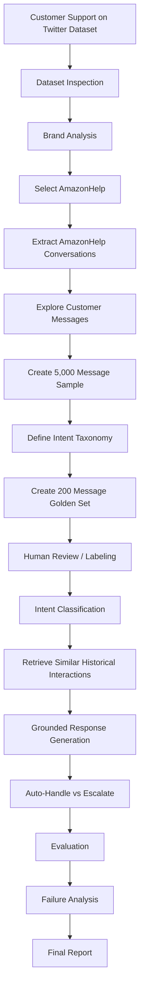
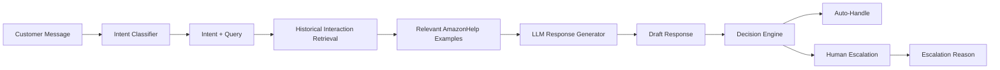

# Hiver SDE Intern — AI Customer Support Agent

An AI-powered customer support system built using the **Customer Support on Twitter** dataset.

The goal of this project is to build and evaluate an AI support agent for a single brand that can:

1. Classify incoming customer messages into a small set of intents.
2. Retrieve relevant historical customer-support interactions.
3. Draft a response grounded in how the brand historically handled similar issues.
4. Decide whether the request can be auto-handled or should be escalated to a human.
5. Evaluate the system using a manually reviewed golden evaluation set.

---

# 1. Problem Framing

Customer-support conversations on Twitter are noisy, short, informal, and often lack context.

For this project, the selected brand is **AmazonHelp**.

The system is designed to answer a practical question:

> Given a new Amazon customer-support message, can we understand the customer's problem, find relevant historical examples, generate a grounded response, and decide whether automation is safe?

## What "Good" Means

A good support agent should:

- Correctly understand the customer's intent.
- Retrieve relevant historical support interactions.
- Generate responses that are consistent with historical resolutions.
- Avoid inventing information that is not supported by retrieved evidence.
- Handle straightforward and common issues automatically.
- Escalate uncertain, sensitive, or repeatedly unresolved issues.
- Provide a reason whenever a conversation is escalated.

## What We Chose Not to Build

The initial version intentionally does not attempt to:

- Build a production-scale customer-support platform.
- Process the complete ~3M tweet dataset at inference time.
- Automatically perform real-world actions such as refunds or order cancellations.
- Replace human agents completely.
- Build a general-purpose chatbot for every brand.
- Support every possible customer-support issue.
- Treat every short Twitter message as independently understandable.

The focus is on demonstrating a reliable and measurable AI support workflow for one brand.

---

# 2. Project Workflow

The project is developed in the following stages:



---

# 3. AI Support Agent Architecture

The final AI support workflow is designed as:



## Main Components

### 1. Intent Classification

The incoming customer message is classified into one of the predefined support intents.

### 2. Historical Retrieval

Relevant historical AmazonHelp interactions are retrieved from the dataset.

This provides grounding for the response generation stage.

### 3. Response Generation

The LLM receives:

- Customer message
- Predicted intent
- Relevant historical interactions

and generates a support response grounded in the retrieved evidence.

### 4. Decision Engine

The system decides whether to:

```text
AUTO-HANDLE
```

or:

```text
ESCALATE TO HUMAN
```

The decision includes a reason.

---

# 4. Dataset

The project uses the **Customer Support on Twitter** dataset.

The dataset contains approximately 3 million tweets from customer-support conversations between customers and brands.

Each tweet contains information such as:

- Tweet ID
- Author ID
- Whether the tweet is inbound
- Creation timestamp
- Tweet text
- Response tweet ID
- Parent tweet ID

The dataset contains multi-turn conversations and is intentionally noisy.

## Dataset Handling

The complete dataset is not committed to GitHub because of its large size.

Instead, the project uses:

- A selected brand
- A sampled subset for development
- A smaller golden evaluation set

This keeps experimentation fast and reproducible.

---

# 5. Brand Selection

Multiple brands were analyzed using the support-authored tweets in the dataset.

AmazonHelp was selected because it has a substantially larger number of support-authored tweets than the other analyzed brands.

This provides enough historical support interactions for:

- Intent discovery
- Retrieval
- Response grounding
- Evaluation

---

# 6. Intent Taxonomy

The initial taxonomy contains the following intents:

| Intent | Description |
|---|---|
| `DELIVERY_DELAY` | Order is late, delayed, or expected delivery time was missed |
| `DELIVERY_NOT_RECEIVED` | Tracking says delivered but customer did not receive the package |
| `ORDER_STATUS` | Customer asks about order location, tracking, ETA, or delivery status |
| `RETURN_REFUND` | Return, refund, replacement, damaged/wrong item issues where return/refund is the main concern |
| `ACCOUNT_ACCESS` | Login, password, locked, suspended, or account-access/security issues |
| `PRIME_MEMBERSHIP` | Prime subscription, renewal, cancellation, benefits, or Prime-specific charges |
| `PAYMENT_BILLING` | Payment, card, bank transaction, duplicate charge, billing, gift card, or money/charge dispute |
| `PRODUCT_TECHNICAL` | Technical issues involving Amazon devices, apps, websites, or product functionality |
| `CUSTOMER_SERVICE_ESCALATION` | Customer requests human/manager support or reports a repeated unresolved issue |
| `SKIP` | Irrelevant, extremely vague, simple thanks, link-only, tag-only, or messages that do not clearly fit the taxonomy |

The taxonomy may be revised after human review if the data shows that important categories are missing or poorly separated.

---

# 7. Data Preparation Pipeline

The current preprocessing pipeline contains several stages.

## Dataset Inspection

```bash
python src/inspect_data.py
```

Used to inspect:

- Dataset structure
- Columns
- Data types
- Missing values
- Sample records

## Brand Analysis

```bash
python src/brand_analysis.py
```

Analyzes support-authored tweets and identifies brands with sufficient historical support data.

## Brand Extraction

```bash
python src/extract_brand.py
```

Extracts AmazonHelp-related customer-support interactions.

## Customer Message Exploration

```bash
python src/view_customer_messages.py
```

Used to inspect customer messages and identify recurring support issues.

## Training Sample

```bash
python src/create_training_sample.py
```

Creates a 5,000-message development sample.

## Training Sample Inspection

```bash
python src/inspect_training_sample.py
```

Used to manually inspect the sampled messages.

---

# 8. Golden Evaluation Set

A 200-message golden evaluation set was created from the sampled customer messages.

```text
Golden set size: 200 messages
```

The purpose of the golden set is to provide a fixed evaluation dataset that can be used to compare:

- Trivial baseline
- Simple baseline
- Final AI support system

## Sampling

The golden set is sampled from the customer-message development sample using a fixed random seed.

This makes the evaluation reproducible.

## Labeling

The initial labeling pipeline uses Gemini for batch-assisted classification.

However, the final golden labels will be manually reviewed because the assignment requires a **hand-labelled evaluation set**.

The goal is to ensure that the golden set represents human judgment rather than blindly treating an LLM prediction as ground truth.

---

# 9. Gemini-Based Batch Labeling

Gemini is currently used to assist with intent labeling.

The labeling script processes messages in batches rather than sending one API request per message.

```bash
python src/auto_label_golden_set.py
```

The script:

1. Loads the golden set.
2. Detects previously labeled messages.
3. Sends only unlabeled messages to Gemini.
4. Classifies them into the defined intent categories.
5. Stores a confidence score.
6. Saves progress after every successful batch.
7. Stops safely if an API error or quota limit occurs.
8. Continues from the existing output when run again.

This makes the labeling process resilient to API interruptions.

---

# 10. Retrieval / RAG Component

The core grounding mechanism will retrieve historical AmazonHelp interactions that are similar to the incoming customer message.

Conceptually:

```text
New Customer Message
        |
        v
   Query Processing
        |
        v
 Historical Interaction Search
        |
        v
 Top-K Similar Conversations
        |
        v
 Historical Resolutions
        |
        v
       LLM
```

The retrieval system should prefer historical examples that are:

- Semantically similar
- Relevant to the predicted intent
- From the same brand
- Associated with useful support responses

The retrieved interactions will be passed to the response generator as evidence.

---

# 11. Grounded Response Generation

The response generator will receive the customer message together with retrieved historical support examples.

Example:

```text
Customer:
"My package says delivered but I never received it."

Predicted Intent:
DELIVERY_NOT_RECEIVED

Historical Examples:
- Similar customer issue + AmazonHelp response
- Similar customer issue + AmazonHelp response
- Similar customer issue + AmazonHelp response
```

The LLM then generates a response based on the available evidence.

The system should avoid:

- Unsupported claims
- Invented policies
- Invented refund amounts
- Invented delivery dates
- Pretending that an action has already been performed

---

# 12. Auto-Handle vs Human Escalation

The system will also make an operational decision.

## Auto-Handle

A message may be automatically handled when:

- Intent confidence is sufficiently high.
- Retrieved historical evidence is relevant.
- The issue is a common support problem.
- The generated response is grounded.
- There is no strong reason for human intervention.

## Escalate

A message should be escalated when:

- Intent confidence is low.
- Relevant historical evidence cannot be found.
- The customer reports a repeatedly unresolved issue.
- The customer explicitly requests a human or manager.
- The issue appears sensitive or ambiguous.
- The system cannot generate a sufficiently grounded response.

Example:

```text
Decision: ESCALATE

Reason:
The customer reports a repeatedly unresolved issue and
explicitly requests further human assistance.
```

---

# 13. Evaluation Strategy

The assignment emphasizes proving that the system works rather than only building the system.

Evaluation will therefore compare the final system against simple baselines.

## Baseline 1 — Trivial Baseline

Always predict the most frequent intent in the golden set.

This establishes a minimum performance level.

## Baseline 2 — Simple Keyword Baseline

Use manually defined keyword rules for common intents.

Example:

```text
"late", "delayed"
        -> DELIVERY_DELAY

"delivered but"
        -> DELIVERY_NOT_RECEIVED

"refund", "return"
        -> RETURN_REFUND

"payment", "charged", "card"
        -> PAYMENT_BILLING
```

This provides a simple non-LLM comparison.

## Final System

The final system will combine:

```text
Intent Classification
        +
Historical Retrieval
        +
Grounded Response Generation
        +
Escalation Decision
```

---

# 14. Evaluation Metrics

## Intent Classification

Metrics:

- Accuracy
- Macro F1
- Per-intent precision
- Per-intent recall
- Confusion matrix

Macro F1 is particularly useful because some intents may occur much less frequently than others.

## Retrieval

Potential metrics:

- Recall@K
- Precision@K
- Relevance of retrieved historical interactions

## Response Quality

The generated responses will be evaluated using an LLM-as-judge rubric.

The judge will evaluate dimensions such as:

### Groundedness

Does the response remain consistent with the retrieved historical evidence?

### Helpfulness

Does it address the customer's actual problem?

### Relevance

Does it avoid unnecessary information?

### Correctness

Does it avoid unsupported or contradictory claims?

### Actionability

Does it provide a useful next step when appropriate?

---

# 15. LLM-as-Judge

A separate LLM evaluation step will score generated responses using a fixed rubric.

Example:

```text
Groundedness: 1-5
Helpfulness: 1-5
Relevance: 1-5
Correctness: 1-5
Actionability: 1-5
```

The judge will not be treated as perfect ground truth.

A subset of responses will also be reviewed by a human.

The goal is to measure how well the automated judge agrees with human judgment.

---

# 16. Human vs LLM Judge Agreement

A sample of generated responses will be independently evaluated by a human using the same rubric.

The project will compare:

```text
Human Evaluation
       vs
LLM-as-Judge
```

Possible agreement measurements include:

- Exact agreement
- Mean absolute score difference
- Correlation
- Agreement on acceptable/unacceptable responses

The final report will document the observed agreement.

---

# 17. Results

Final evaluation results will be added after the complete pipeline has been implemented.

| System | Intent Accuracy | Macro F1 | Response Score | Escalation Quality |
|---|---:|---:|---:|---:|
| Trivial Baseline | TBD | TBD | TBD | TBD |
| Keyword Baseline | TBD | TBD | TBD | TBD |
| Final AI Agent | TBD | TBD | TBD | TBD |

No performance numbers are reported until they have been measured on the final reviewed golden set.

---

# 18. Failure Analysis

The final evaluation will identify the top five failure modes.

For each failure mode, the report will contain:

1. Real example
2. Expected behavior
3. Actual behavior
4. Why the system failed
5. Hypothesis
6. Possible improvement

Potential failure categories to investigate include:

- Very short/context-dependent messages
- Overlapping intents
- Incorrect retrieval
- Insufficient historical evidence
- Ambiguous customer requests

These will only be included as final failure modes if supported by actual evaluation examples.

---

# 19. What Is Misleading About My Headline Number?

This is a mandatory part of the evaluation.

A high headline metric can hide important weaknesses.

For example, overall accuracy can be misleading if:

- One intent dominates the dataset.
- `SKIP` represents a large proportion of examples.
- Easy examples dominate the golden set.
- Short or context-dependent messages are underrepresented.
- The evaluation set is small.
- The model performs poorly on rare intents.
- Response quality is not captured by classification accuracy.

Therefore, the final report will present the headline number together with:

- Macro F1
- Per-intent performance
- Failure examples
- Response-quality scores
- Human-vs-LLM judge agreement

---

# 20. Decision Log

Important non-obvious project decisions will be documented here.

### Decision 1 — Select AmazonHelp

AmazonHelp was selected because it provides a large historical support dataset suitable for retrieval and evaluation.

### Decision 2 — Use a Small Intent Taxonomy

A limited number of intents was chosen to keep classification practical and interpretable.

### Decision 3 — Add SKIP

Some Twitter messages are too vague, irrelevant, or lack enough context to classify reliably. These are assigned to `SKIP`.

### Decision 4 — Use a Development Sample

The complete dataset is large, so a smaller sample is used during development.

### Decision 5 — Create a Fixed Golden Set

A fixed 200-message evaluation set allows repeatable comparison between different system versions.

### Decision 6 — Save Labeling Progress

The Gemini labeling pipeline saves progress after each batch so API failures do not destroy previous work.

### Decision 7 — Human Review of Golden Labels

LLM-generated labels are treated as assistance rather than unquestioned ground truth.

### Decision 8 — Use Historical Support Interactions for Grounding

Historical AmazonHelp conversations provide evidence for response generation.

### Decision 9 — Include an Escalation Path

The system should not attempt to automatically answer every customer issue.

### Decision 10 — Compare Against Simple Baselines

A system is only useful if it improves over simple alternatives.

### Decision 11 — Evaluate Response Quality Separately

A correct intent prediction does not guarantee a good customer-support response.

### Decision 12 — Evaluate the LLM Judge

The LLM judge itself is evaluated against human ratings instead of being treated as perfect.

---

# 21. Current Project Structure

```text
hiver-sde-assignment/
│
├── data/
│   ├── golden_set.csv
│   ├── golden_set_labeled.csv
│   └── training_sample.csv
│
├── src/
│   ├── inspect_data.py
│   ├── brand_analysis.py
│   ├── extract_brand.py
│   ├── view_customer_messages.py
│   ├── sample_customer_messages.py
│   ├── create_training_sample.py
│   ├── inspect_training_sample.py
│   ├── create_golden_set.py
│   ├── label_golden_set.py
│   ├── auto_label_golden_set.py
│   └── gemini_test.py
│
├── .gitignore
└── README.md
```

Additional files and directories will be added as the retrieval, generation, decision, and evaluation components are implemented.

---

# 22. Setup

## Requirements

- Python 3.x
- pandas
- Google Gemini API access

Install dependencies:

```bash
pip install pandas google-genai
```

## Gemini API Key

Set the API key as an environment variable.

### Windows PowerShell

```powershell
$env:GEMINI_API_KEY="your_api_key"
```

Verify that the variable exists:

```powershell
if ($env:GEMINI_API_KEY) {
    echo "API key loaded successfully"
} else {
    echo "API key NOT found"
}
```

Never commit an API key to GitHub.

---

# 23. Running the Project

## Inspect Dataset

```bash
python src/inspect_data.py
```

## Analyze Brands

```bash
python src/brand_analysis.py
```

## Extract AmazonHelp Data

```bash
python src/extract_brand.py
```

## Explore Customer Messages

```bash
python src/view_customer_messages.py
```

## Create Training Sample

```bash
python src/create_training_sample.py
```

## Inspect Training Sample

```bash
python src/inspect_training_sample.py
```

## Create Golden Set

```bash
python src/create_golden_set.py
```

## Run Gemini Batch Labeling

```bash
python src/auto_label_golden_set.py
```

The labeling process saves progress after each successful batch.

If the API quota or another temporary error is reached, the script can be run again later and will continue with the remaining unlabeled messages.

---

# 24. Reproducibility

The project uses fixed random seeds for dataset sampling.

This allows the development sample and golden set to be reproduced consistently.

The original large dataset is intentionally excluded from GitHub.

A user reproducing the project should:

1. Download the Customer Support on Twitter dataset.
2. Place the dataset at:

```text
data/twcs.csv
```

3. Install the required Python dependencies.
4. Configure the Gemini API key.
5. Run the pipeline scripts in order.

The final README will be updated with the exact commands required to reproduce the headline evaluation results in under 15 minutes.

---

# 25. Privacy and Secrets

API credentials must never be committed to the repository.

The project uses environment variables for API credentials.

Large raw dataset files are also excluded from Git using `.gitignore`.

---

# 26. Limitations

Current limitations include:

- Twitter messages can be extremely short and context-dependent.
- Historical conversations may contain incomplete information.
- Intent categories are manually designed and may not cover every issue.
- Historical responses may themselves contain inconsistencies.
- Retrieval quality directly affects response quality.
- LLM-generated responses require evaluation before being trusted.
- Automated escalation decisions should be conservative.
- The development dataset is a sample rather than the complete dataset.

---

# 27. What I Would Do With One More Week

With an additional week, I would focus on:

1. Improving retrieval quality.
2. Testing different embedding/retrieval strategies.
3. Improving intent boundaries using confusion-matrix analysis.
4. Adding conversation-level context instead of relying only on individual tweets.
5. Improving escalation rules using evaluation data.
6. Increasing human evaluation coverage.
7. Calibrating confidence thresholds.
8. Testing response generation with multiple retrieved examples.
9. Adding automated regression tests.
10. Evaluating robustness on unseen customer-support messages.

---

# 28. Project Status

### Completed

- [x] Dataset inspection
- [x] Brand analysis
- [x] AmazonHelp selected
- [x] AmazonHelp data extraction
- [x] Customer message exploration
- [x] 5,000-message development sample
- [x] Initial intent taxonomy
- [x] 200-message golden evaluation set
- [x] Gemini batch-labeling pipeline
- [x] Progress-safe labeling pipeline

### In Progress

- [ ] Complete golden-set labeling
- [ ] Human verification of golden labels
- [ ] Historical interaction retrieval
- [ ] RAG pipeline
- [ ] Grounded response generation
- [ ] Auto-handle vs escalation decision engine
- [ ] Evaluation harness
- [ ] LLM-as-judge
- [ ] Human vs LLM judge agreement
- [ ] Baseline comparison
- [ ] Failure analysis
- [ ] Final report

---

# 29. Final Goal

The final system should demonstrate the following complete workflow:

```text
Customer Message
       |
       v
Intent Classification
       |
       v
Historical AmazonHelp Retrieval
       |
       v
Relevant Historical Resolutions
       |
       v
Grounded LLM Response
       |
       v
Auto-Handle / Escalate
       |
       +-------------------+
       |                   |
       v                   v
   Auto-Handle          Human Agent
       |
       v
Customer Response
```

The primary goal is not simply to achieve a high metric.

The goal is to demonstrate that the system can:

- Understand customer problems
- Use historical evidence
- Generate grounded responses
- Make safe automation decisions
- Explain failures
- And provide measurable evidence that the system works
